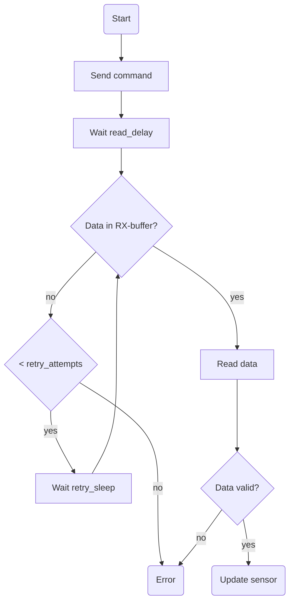

# esphome-rego600
Started as a fork of [Husdata H60 Arduino get started code](https://github.com/peterarandis/H60-OS) but it is now broken out as stand-alone custom component. Used a lot of influence from the following projects:
  - [esphome/components/dsmr](https://github.com/esphome/esphome/tree/dev/esphome/components/dsmr) (how to combide a back-bone service and different types of child entities)
  - [stream server for ESPHome](https://github.com/oxan/esphome-stream-server/) (how to create a service communicating over UART)
  - [custom component esphome-rego1000](https://github.com/jagheterfredrik/esphome-rego1000) (a related integration, have been trying to keep external design as similar as possible)
  - [how to connect heat pump with Rego 6xx controller](https://rago600.sourceforge.net/) (a lot of information about the Rego600 interface)
  - [openhab addons](https://github.com/openhab/openhab-addons/tree/main/bundles/org.openhab.binding.regoheatpump), [mappings](https://github.com/openhab/openhab-addons/blob/main/bundles/org.openhab.binding.regoheatpump/src/main/java/org/openhab/binding/regoheatpump/internal/rego6xx/RegoRegisterMapper.java) (SW implementation for the interface)

To be used as custom component to ESPHome

## Planned functions
  - (done) Wifi connection with DHCP and fixed SSID/PASS
  - (done) Web page showing status and heat pump data (ESPHome)
  - (untested) Communication with heat pump via ESPHome UART component
  - Provide input and output entities based on heat-pump model

> **NOTE**: This integration is still in development and used at own risk. Connecting unsupported devices to your heat-pump via service interface may
cause important settings to be overwritten and lost. Please start small with some read-only sensors.

## Add the following to your ESPHome config

All entities are extendable with normal additional attrubutes as "unit_of_measurement", "state_class" etc.

An as complete as possible configuration package as possible is provided in [rego600.yaml](rego600.yaml).
Please use information from above provided links to adapt to your needs and model.
When up and working it might be a good idea to prepare these type of templates [rego1000-v3.7.0.yaml](https://github.com/jagheterfredrik/esphome-rego1000/blob/main/rego1000-v3.7.0.yaml)

```yaml
external_components:
  - source: github://dala318/esphome-rego600

uart:
  id: uart_bus
  tx_pin: GPIO12
  rx_pin: GPIO13
  baud_rate: 19200
  debug:            # Optional, good for degugging input/output of UART
    direction: BOTH
    dummy_receiver: false

rego600:
  uart_id: uart_bus
  log_all: true
  id: rego600_hub
  log_all: true     # Optional, print some more
  read_delay: 10ms  # Optional, delay to first reading of UART
  retry_sleep: 20ms # Optional, delay between read attempts
  retry_attempts: 1 # Optional, number of read retry attempts

binary_sensor:
  - platform: rego600
    rego600_id: rego600_hub  # Optional if only one hub
    name: Radiator pump P1
    rego_variable: 0x0203

sensor:
  - platform: homeassistant  # Get actual indoor temp from other sensor, could also be a sensor read from rego600
    entity_id: sensor.indoor_temperature
    id: indoor_temp

  - platform: rego600
    name: Radiator return GT1
    rego_variable: 0x0209
    value_factor: 10          # Optional, scale factor multiply real->register value
    unit_of_measurement: °C   # Optional, set at your own desire
    state_class: measurement  # Optional, set at your own desire
    accuracy_decimals: 1      # Optional, set at your own desire

  - platform: rego600
    name: Outdoor GT2
    rego_variable: 0x020A

climate:              # Climate not really finalized, might still work
  - platform: rego600
    name: House temp
    rego_variable: 0x0010
    sensor_id: indoor_temp

number:
  - platform: rego600
    name: GT1 Target value
    rego_variable: 0x006E
    value_factor: 10  # Optional, scale factor multiply real->register value
    min_value: 0
    max_value: 100
    step: 1
    retry_write: 1    # Optional, retry writing event if com bussy

button:
  - platform: rego600
    name: External control
    rego_variable: 0x0213
    payload: 0x01     # Optional, data to provide on action
    retry_write: 3    # Optional, retry writing event if com bussy
```

## Function overview

Flow overview for updating a single sensor entity




For HW debugging it's suggested to use a [stream server](https://github.com/oxan/esphome-stream-server) to your config for direct connection between your PC and heat-pump. But have not tested this in combination and possible that the rego600 component and stream_server will not work together, stealing received messages from each other.
